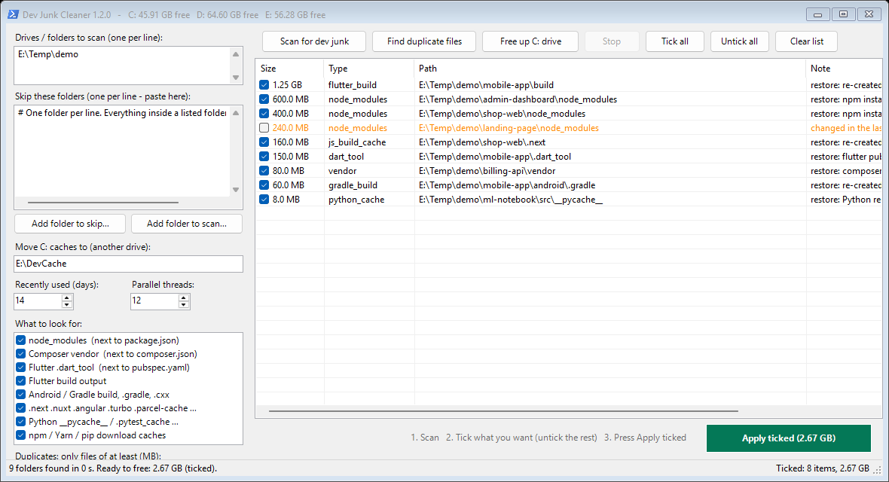

<p align="center"></p>

# Dev Junk Cleaner

A small Windows app that frees disk space for developers. It finds folders that can always be re-created, such as `node_modules`, Composer `vendor`, Flutter/Gradle build output and `.next` caches, and deletes the ones you tick. It can also find duplicate large files and free up the system drive (C:).



**[Download the latest release](https://github.com/bhskr44/dev-junk-cleaner/releases/latest)**: one `DevJunkCleaner.exe`, nothing to install. It runs on Windows 10 and 11 with .NET Framework 4.8, which comes with Windows.

> The exe is not code-signed yet, so Windows may show *Windows protected your PC*. Click **More info → Run anyway**. Checksums are attached to each release.

## What it does

**Scan for dev junk.** It walks your drives with several threads (a whole drive usually takes seconds) and lists:

| Folder | Only when next to | Restore with |
|---|---|---|
| `node_modules` | `package.json` | `npm install` |
| `vendor` | `composer.json` | `composer install` |
| `.dart_tool`, `build` | `pubspec.yaml` | `flutter pub get` / next build |
| `build`, `.gradle`, `.cxx` | `build.gradle(.kts)` / `settings.gradle(.kts)` | next Gradle build |
| `.next`, `.nuxt`, `.svelte-kit`, `.angular`, `.turbo`, `.parcel-cache` | `package.json` | next dev/build |
| `__pycache__`, `.pytest_cache`, `.mypy_cache`, `.ruff_cache` | — | Python re-creates them |
| npm `_cacache`, Yarn and pip caches | known cache locations only | downloaded again when needed |

**Find duplicate files.** Same-size files are compared by their first and last 1 MB, and only then by a full SHA-256. The oldest copy is always kept, and the extra copies start unticked.

**Free up C: drive.** It finds old versions of installed apps, installer leftovers, crash reports, shader caches, old temp files, browser and app caches, and the Recycle Bin.
- It can move big caches (Gradle, npm, Android SDK and emulators, VS Code extensions, WSL disks…) to another drive and leave a link behind, so nothing has to be downloaded again.
- It can shrink the hibernation file. This asks for admin.
- It explains how to deal with the page file, the Docker disk and Chrome's on-device AI model.

## Safety

- Nothing changes until you press **Apply ticked** and confirm.
- Folders changed in the last 14 days (you can change this) are listed but not ticked, because they are probably in use.
- Junctions and symbolic links are never followed. Every item is checked again right before it is deleted.
- `.git`, Windows and Program Files are never touched, and neither is anything in your **skip list**. Paste folders into the skip list, or right-click a row and choose "Skip this folder".
- Rows for apps that are running are not ticked, and Apply refuses them until you close the app.

Settings and the skip list are stored in `%LOCALAPPDATA%\DevJunkCleaner`.

## Build from source

```
build.cmd
```

This compiles `src\DevJunkCleaner.cs` into `dist\DevJunkCleaner.exe` with the C# compiler that ships with Windows, so no SDK or Visual Studio is needed. `tools\make-icon.ps1` regenerates the icon.

To publish a release (needs the [GitHub CLI](https://cli.github.com/)): bump `AssemblyVersion` in `src\DevJunkCleaner.cs`, commit, push, then run

```
powershell -ExecutionPolicy Bypass -File release.ps1
```

## License

[MIT](LICENSE)
